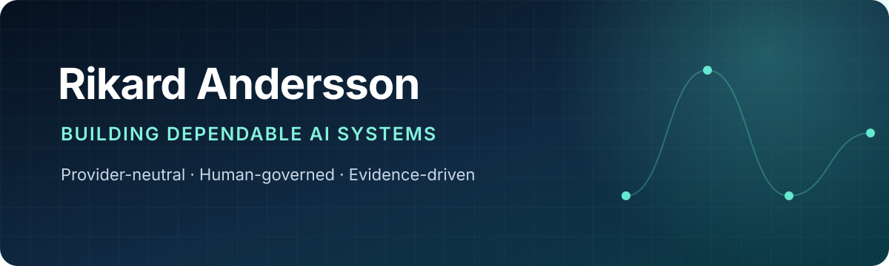

  

  <a href="https://cortxt.io">Webbplats</a> ·
  <a href="https://docs.cortxt.io">Dokumentation</a> ·
  <a href="https://github.com/rian010194/cortxt">Cortxt på GitHub</a>

## Hej, jag är Rikard

Jag är en självlärd fullstack-utvecklare från Malmö som bygger **Cortxt** — en
leverantörsoberoende plattform för långvarigt AI-arbete under mänskligt mandat.

Jag är särskilt intresserad av systemen runt modellerna: hur arbete kan styras,
återupptas och verifieras utan att användarens kontext, tillstånd eller historik
blir låst till en enda leverantör.

> Modeller ska vara utbytbara resurser. Användaren ska äga arbetets tillstånd,
> minne, verktyg och evidens.

## Det jag bygger

<table>
  <tr>
    <td width="50%" valign="top">
      <h3><a href="https://github.com/rian010194/cortxt">Cortxt</a></h3>
      
En provider-neutral plattform för att skapa, styra, återuppta och verifiera långvarigt AI-arbete.

      
<strong>Fokus:</strong> reasoning runtime, portabelt tillstånd, policy-styrd exekvering, CLI och MCP.

      
<code>Python</code> <code>TypeScript</code> <code>Astro</code> <code>MCP</code>

    </td>
    <td width="50%" valign="top">
      <h3><a href="https://github.com/rian010194/cortxt-resilient-inference">Resilient Inference</a></h3>
      
Ett fristående lager för policy-styrd fallback mellan inference-leverantörer.

      
<strong>Fokus:</strong> explicita policies, hårda timeouts, återhämtning och observerbart beslutsunderlag.

      
<code>Python</code> <code>HTTP</code> <code>Policy gates</code>

    </td>
  </tr>
</table>

## Så tänker jag kring AI-system

- **Mänskligt mandat före blind autonomi** — operatören ska kunna förstå,
  begränsa och ta över.
- **Portabilitet före inlåsning** — modeller och leverantörer ska gå att byta
  utan att arbetet förlorar sin identitet.
- **Evidens före illusionen av säkerhet** — viktiga beslut ska kunna följas
  tillbaka till körning, policy och källa.
- **Byggt i verkligheten** — Cortxt utvecklas öppet som både produkt och ett
  praktiskt bevis på arkitekturen.

## Verktyg jag arbetar med

`Python` · `TypeScript` · `React` · `Astro` · `FastAPI` · `Flask` · `MCP` ·
`Docker` · `GitHub Actions`

  Just nu: Cortxt v0.2 — state portability, provider-neutral execution och tydligare människa–AI-handoffs.

